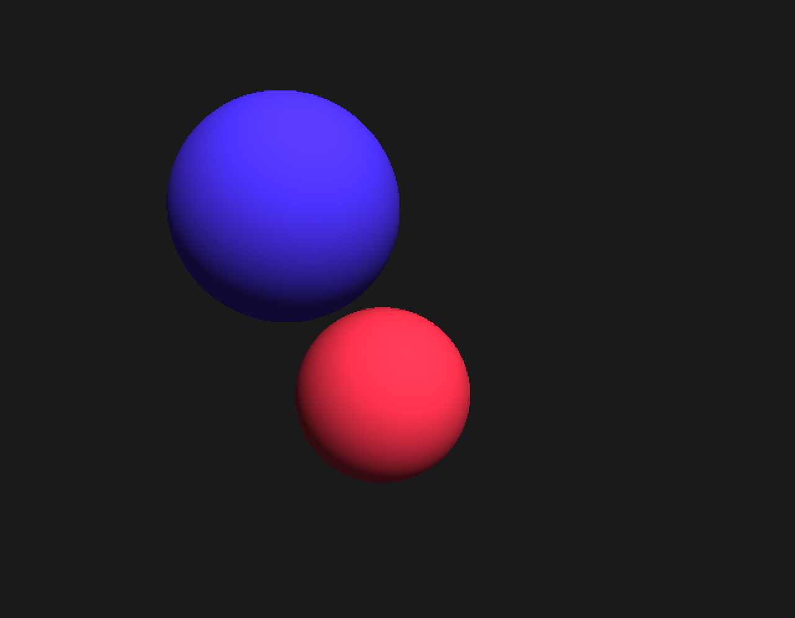

# 3D Raytracing Renderer

This project was a kind of first step in GPU coding for me. It uses SFML and its fragment shaders support with GLSL.
Only supports rendering of spheres at the moment
## Screenshots

## Controls
The Camera can be moved using Z,Q,S,D, Space for going up and LShift to go down. Look around with right click and drag.  
Controls can be edited in [input_config.xml](res/input_config.xml)
## TODO 

* Better Mouse handling
* variable Light Source